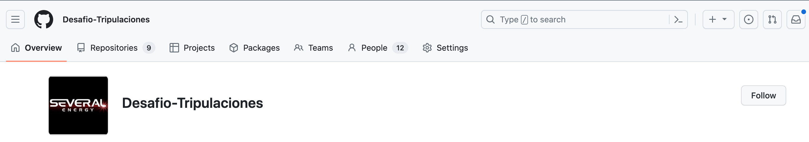
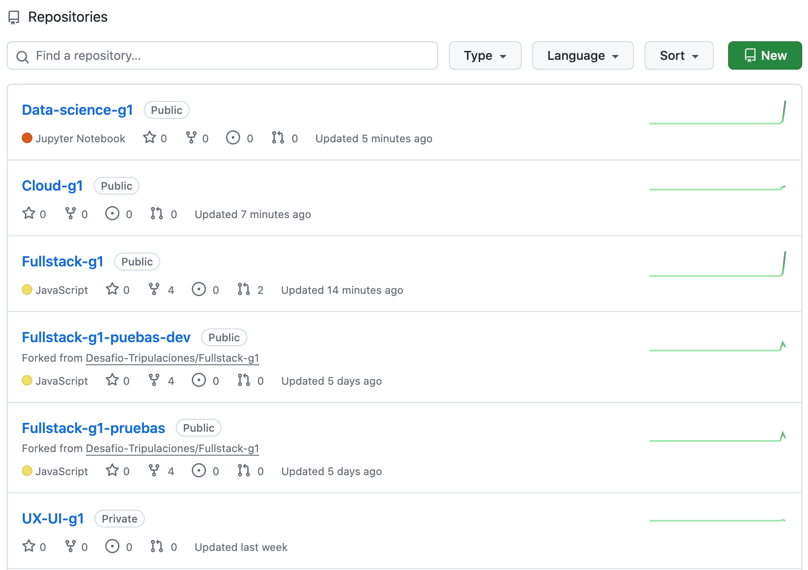
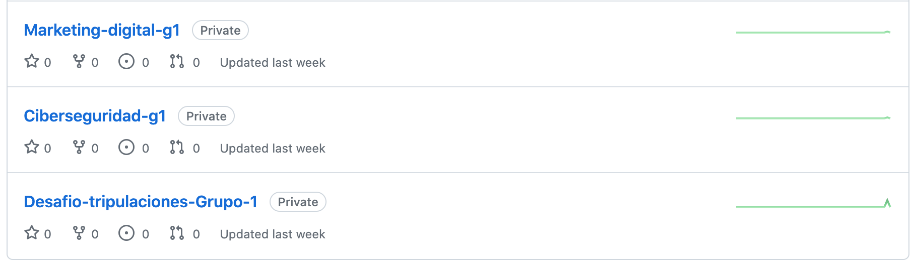
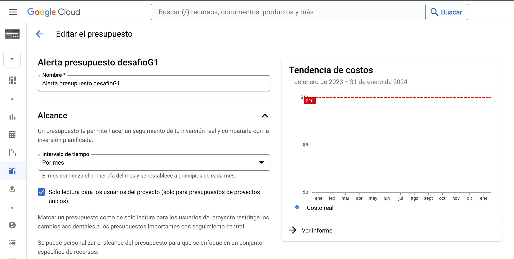
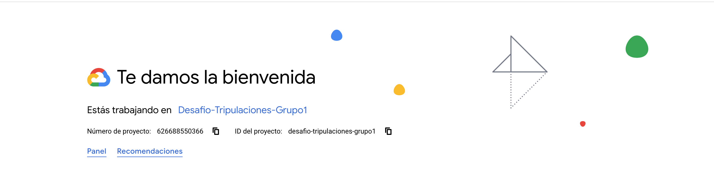
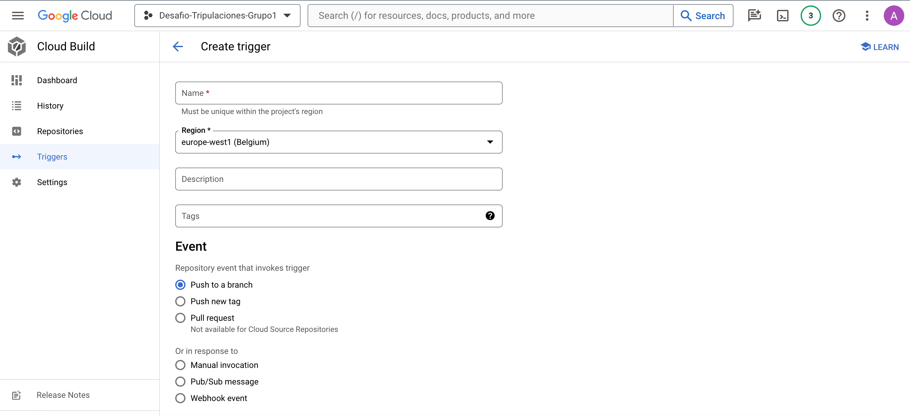
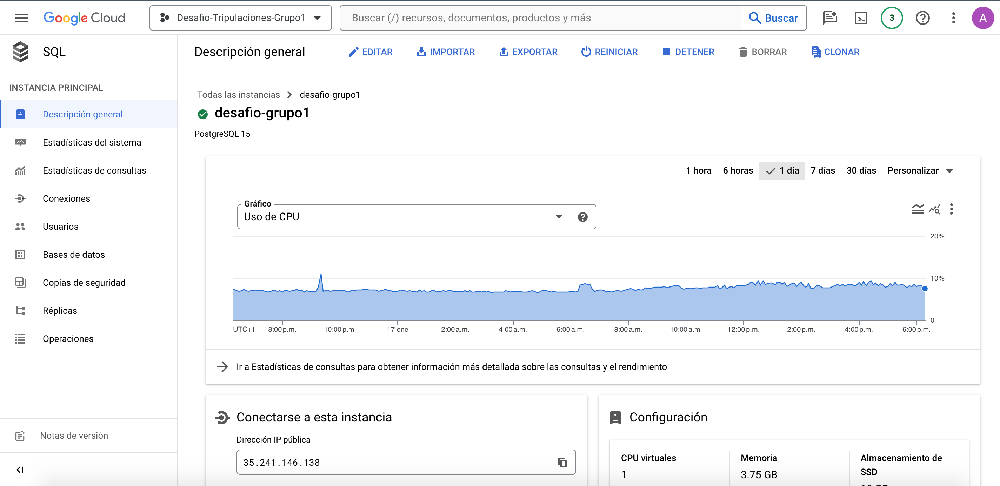
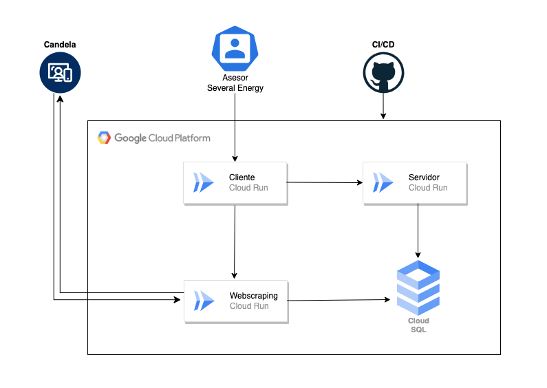

## Descripción del Proyecto

Este proyecto tiene como objetivo proporcionar una infraestructura eficiente en la nube utilizando Google Cloud Platform (GCP). Nuestro equipo se centrará en implementar un sistema completo que incluye un frontend y un backend, ambos desplegados de forma independiente en Cloud Run, y una base de datos PostgreSQL gestionada por GCP SQL.

## Servicios Utilizados

### 1. Frontend y Backend en Cloud Run

Tanto el frontend como el backend de nuestra aplicación se implementarán utilizando Google Cloud Run, un servicio que permite ejecutar contenedores de manera eficiente y sin preocuparse por la infraestructura subyacente. Cloud Run escala automáticamente según la demanda, garantizando un rendimiento óptimo y una gestión eficiente de los recursos.

### 2. CI/CD con Cloud Build

La integración continua (CI) y la implementación continua (CD) se llevarán a cabo mediante Cloud Build. Este servicio se configurará para ejecutarse automáticamente cuando se realicen cambios en el repositorio de GitHub asociado al proyecto. Cloud Build se encargará de compilar, probar y desplegar automáticamente tanto el frontend como el backend en Cloud Run.

### 3. Base de Datos PostgreSQL en GCP SQL

La gestión de datos estará a cargo de una base de datos PostgreSQL gestionada por Google Cloud SQL. Este servicio proporciona una base de datos relacional altamente disponible y completamente administrada, lo que garantiza la seguridad y la escalabilidad mientras nos permite centrarnos en el desarrollo de la aplicación en lugar de la gestión de la base de datos.

### 4. Aplicación para Webscraping en Cloud Run

Para llevar a cabo la implementación del script de webscraping proporcionado por la vertical de Data, hemos elegido montarlo en un entorno de ejecución altamente escalable y eficiente, específicamente, un recurso de **Cloud Run**. Previamente, hemos contenerizado este script mediante Docker y gestionado su despliegue de manera automatizada a través de Cloud Build.

## Pasos a seguir:

### Paso 1.

En el inicio del Desafío, se llevará a cabo la creación de una organización en GitHub, la cual albergará un repositorio principal con submódulos designados para cada una de las verticales. Este enfoque estratégico nos permitirá consolidar el trabajo de todas las verticales en un único repositorio principal, proporcionando un espacio centralizado para la colaboración. Cada vertical trabajará de forma independiente en sus respectivos repositorios (submódulos), permitiendo un desarrollo ágil y modularizado.

Como parte de la planificación inicial, hemos definido cuidadosamente los permisos asignados a los miembros de la organización en relación con el repositorio principal y sus submódulos correspondientes. Esta estructura de permisos está diseñada para garantizar un equilibrio entre la colaboración eficiente y la seguridad del proyecto. Cada integrante de la organización tendrá acceso específico y bien definido, de acuerdo con su función y responsabilidad en el desarrollo del proyecto.

La decisión de implementar esta organización y estructura de repositorio se basa en la necesidad de facilitar la coordinación y gestión del proyecto. Al centralizar el trabajo en el repositorio principal, se promueve una visión holística del progreso y se optimiza la administración de las diferentes verticales. Al mismo tiempo, la independencia de cada vertical en sus propios submódulos permite una flexibilidad óptima para el desarrollo paralelo y la escalabilidad del proyecto.

Este enfoque organizativo, respaldado por una cuidadosa asignación de permisos, sienta las bases para un trabajo eficiente y colaborativo, asegurando que cada miembro de la organización pueda contribuir de manera efectiva a su vertical específica, al tiempo que mantiene la cohesión del proyecto en su conjunto.

En paralelo, una vez que hemos seleccionado la plataforma en la nube para llevar a cabo nuestro trabajo, específicamente Google Cloud, hemos dado un paso crucial hacia la configuración efectiva de nuestro entorno de desarrollo. En este contexto, hemos establecido un proyecto dedicado exclusivamente para el Desafío. Esta acción no solo facilita la gestión y la organización de los recursos asociados con el proyecto, sino que también establece un marco de trabajo claro y estructurado para todas las etapas de desarrollo.

Además, como parte de una práctica prudente de gestión financiera, hemos implementado una alerta de presupuesto dentro de la plataforma. Esta alerta está diseñada para supervisar de cerca los gastos que se puedan generar durante el desarrollo del proyecto. La creación de esta alerta de presupuesto no solo refleja nuestro compromiso con la transparencia y la responsabilidad en el uso de recursos, sino que también nos proporciona un mecanismo proactivo para controlar y ajustar nuestras actividades en función de las consideraciones financieras.

Este enfoque estratégico hacia la administración del presupuesto no solo busca evitar sorpresas inesperadas en términos de costos, sino que también contribuye a una toma de decisiones informada y eficiente. La implementación de esta alerta de presupuesto demuestra nuestro compromiso con la optimización de recursos, asegurando que cada gasto esté alineado con los objetivos y las metas del proyecto.

En resumen, la selección de Google Cloud como plataforma, la creación del proyecto dedicado y la implementación de una alerta de presupuesto forman parte integral de nuestra estrategia para asegurar un desarrollo fluido y eficiente, combinando tecnología avanzada con una gestión financiera rigurosa.

### Paso 2.

En el paso 2, hemos dado un paso significativo al recibir una aplicación inicial de Fullstack, diseñada para realizar pruebas y ser implementada en Google Cloud Platform (GCP). Esta aplicación simplificada proporciona la base sobre la cual realizaremos evaluaciones exhaustivas, permitiéndonos identificar los requisitos esenciales y las áreas de mejora a medida que Fullstack continúe aportando actualizaciones y mejoras a la aplicación web.

En respuesta a esta entrega, hemos establecido un repositorio de pruebas dedicado. Aquí, hemos llevado a cabo el proceso de Dockerización de la aplicación recibida, creando una imagen que encapsula de manera eficiente todos los componentes necesarios para su ejecución. Esta imagen sirve como base sólida para la automatización del despliegue mediante la implementación de Cloud Build.

En particular, hemos configurado un flujo de trabajo en Cloud Build que orquesta la creación de una instancia en **Cloud Run**, permitiéndonos levantar la aplicación de manera eficiente y escalable. Este proceso se activa automáticamente mediante un trigger vinculado a la rama del proyecto en la cual Fullstack realiza sus desarrollos y actualizaciones(DEV). De esta manera, garantizamos una integración continua y un despliegue consistente del frontend y el backend de la aplicación cada vez que se actualiza dicha  rama.

Este enfoque de automatización no solo agiliza el proceso de despliegue, sino que también establece una base robusta para la gestión eficiente de actualizaciones y mejoras en la aplicación. Al vincular estrechamente el despliegue a las actualizaciones en el código fuente, aseguramos una sincronización precisa entre el desarrollo de Fullstack y la implementación en la infraestructura de GCP.

En resumen, el paso 2 está marcado por la preparación meticulosa de la aplicación para la implementación en GCP, destacando la importancia de la automatización y la integración continua en nuestro enfoque de desarrollo. Este proceso nos posiciona para una gestión eficiente y ágil a medida que avanzamos en el desarrollo y mejora de la aplicación web.

 

En paralelo, hemos dotado al equipo de Data con una infraestructura de base de datos altamente eficiente al proporcionar una instancia de **Cloud SQL para PostgreSQL 15**, un recurso completamente administrado en Google Cloud Platform (GCP). Esta elección refuerza nuestra estrategia al proporcionar una solución escalable y segura para las necesidades de base de datos del proyecto.

Adicionalmente, hemos optado por utilizar **pgAdmin**, una herramienta integral que facilita el acceso y la administración de esta instancia. Para ello, hemos asignado una IP pública y proporcionado credenciales de usuario y contraseña al equipo de Data. **pgAdmin** permitirá realizar tareas cruciales como la creación y el diseño de contenido en la base de datos de manera eficiente.

La elección de **pgAdmin** como herramienta principal para la gestión de la base de datos se alinea con las mejores prácticas y estándares de la industria. Esta interfaz gráfica de usuario simplifica las operaciones complejas, permitiendo al equipo de Data visualizar y gestionar eficientemente la estructura y el contenido de la base de datos **Cloud SQL para PostgreSQL 15**. Además, facilita la colaboración y el trabajo en equipo al proporcionar una interfaz intuitiva y funcionalidades avanzadas para la administración de bases de datos.

Este enfoque integral en la infraestructura de datos no solo demuestra nuestro compromiso con la eficiencia y la accesibilidad, sino que también sienta las bases para una gestión de datos efectiva a lo largo de todas las fases del proyecto. La combinación de la robustez de **Cloud SQL para PostgreSQL 15** y la intuitividad de **pgAdmin** ofrece al equipo de Data un entorno propicio para la creación, diseño y gestión de una base de datos relacional sólida.

En resumen, la provisión de una instancia **Cloud SQL para PostgreSQL 15** junto con la implementación de **pgAdmin** establece una base sólida para la gestión de datos en el proyecto, brindando al equipo de Data las herramientas necesarias para realizar su trabajo de manera efectiva y colaborativa.

En una iniciativa paralela, hemos avanzado en la asignación de permisos específicos al grupo de Ciberseguridad para otorgarles acceso de lectura a la infraestructura en la nube. Este paso estratégico facilita la capacidad del equipo de Ciberseguridad para llevar a cabo evaluaciones exhaustivas, identificando y analizando posibles riesgos asociados a los servicios creados.

La concesión de permisos de lectura proporciona al equipo de Ciberseguridad una visión integral de la configuración y el funcionamiento de los servicios en la nube. Este acceso permite la revisión detallada de la arquitectura, la identificación de posibles puntos de vulnerabilidad y la realización de evaluaciones de riesgos de manera proactiva.

Esta medida no solo refleja nuestro compromiso con la seguridad del proyecto, sino que también establece una colaboración efectiva entre los equipos técnicos y de seguridad. Al permitir que el equipo de Ciberseguridad realice evaluaciones desde las fases iniciales del desarrollo, garantizamos la identificación temprana de posibles riesgos, lo que facilita la implementación de medidas preventivas y correctivas de manera oportuna.

Además, este enfoque proactivo hacia la seguridad refuerza la solidez y la confiabilidad de la infraestructura en la nube. La cooperación entre los equipos técnicos y de Ciberseguridad crea un marco integral que aborda la seguridad como un aspecto crítico y continuo del desarrollo del proyecto.

En resumen, la concesión de permisos de lectura al grupo de Ciberseguridad demuestra nuestro compromiso con la seguridad desde el inicio del proyecto, permitiendo evaluaciones proactivas y fortaleciendo la robustez de la infraestructura en la nube creada. Este enfoque estratégico asegura que la seguridad sea una consideración central en todas las etapas del desarrollo y la implementación.

### Paso 3.

Para llevar a cabo la implementación del script de webscraping proporcionado por la vertical de Data, hemos elegido montarlo en un entorno de ejecución altamente escalable y eficiente, específicamente, un recurso de **Cloud Run**. Previamente, hemos contenerizado este script mediante Docker y gestionado su despliegue de manera automatizada a través de Cloud Build.

Este enfoque proporciona una solución ágil y modular para ejecutar tareas de webscraping, aprovechando las características de escalabilidad inherentes a Cloud Run. Al contenerizar el script, aseguramos que todas las dependencias y configuraciones necesarias estén encapsuladas, facilitando así su implementación consistente en diferentes entornos.

El script en cuestión se encuentra integrado en el código fuente de Fullstack, ubicado en un directorio específico separado del frontend y el backend. Este enfoque estructurado permite una organización clara y facilita la gestión y mantenimiento independiente de cada componente. Además, el script reside en la rama de desarrollo de Fullstack, lo que garantiza que las actualizaciones y mejoras se realicen de manera iterativa y controlada.

La elección de Cloud Run como plataforma de ejecución refleja nuestra atención a la eficiencia y la escalabilidad. Al utilizar Cloud Build para la automatización del despliegue, nos aseguramos de que cualquier cambio en el código fuente, especialmente en la rama de desarrollo, active automáticamente la construcción y despliegue del script de webscraping en Cloud Run.

Este enfoque integral en la implementación de scripts de webscraping demuestra nuestro compromiso con la eficiencia operativa y la arquitectura moderna. La combinación de contenerización, Cloud Build y Cloud Run establece un flujo de trabajo robusto que garantiza la disponibilidad y el rendimiento óptimo de esta tarea específica en el contexto del desarrollo de Fullstack.

En resumen, la elección de Cloud Run, Docker y Cloud Build para implementar el script de webscraping enfatiza nuestro compromiso con la eficiencia, escalabilidad y modularidad en el desarrollo de Fullstack, asegurando una ejecución confiable y consistente de esta tarea clave.

### Paso 4.

En la fase de desarrollo, hemos orquestado una robusta infraestructura de pruebas en Google Cloud Platform (GCP) mediante la implementación de dos flujos de **Cloud Build** específicos: uno destinado al servidor (backend) y otro al cliente (frontend). Ambos flujos están intrínsecamente vinculados a triggers individuales que activan las compilaciones en la nube, conectadas al repositorio de Fullstack, y más específicamente, a la rama de desarrollo (DEV). Este diseño posibilita la ejecución continua de pruebas y la implementación inmediata de modificaciones propuestas, proporcionando una retroalimentación visual instantánea a todo el equipo de Fullstack.

En paralelo, hemos replicado este enfoque en una segunda pareja de flujos de **Cloud Build**, esta vez configurados para operar exclusivamente en la rama de producción (main) del repositorio de GitHub de nuestra organización. Cabe destacar que hemos aplicado medidas de protección a esta rama, restringiendo su gestión únicamente a nuestra vertical de Cloud. Esta salvaguarda se ha implementado para preservar la estabilidad y la integridad de la rama de producción hasta que las pruebas en la rama de desarrollo sean concluyentes.

La segregación entre las ramas de desarrollo y producción establece un entorno controlado para la iteración y las pruebas continuas. Una vez que las pruebas en la rama de desarrollo alcancen la conclusión satisfactoria y se logre la estabilidad deseada, procederemos a realizar una actualización de la rama de producción (main). Este proceso desencadenará la implementación de los recursos finales en **Cloud Run** en GCP, marcando la transición efectiva de las pruebas al entorno de producción.

Este enfoque estratégico no solo garantiza una implementación fluida y controlada de cambios en la infraestructura, sino que también establece una sólida estructura de gestión del flujo de trabajo en el desarrollo de Fullstack. La integración de **Continuous Integration (CI)**, **Continuous Deployment (CD)**, los triggers selectivos y la protección de la rama de producción reflejan nuestro compromiso con las mejores prácticas de desarrollo, asegurando la estabilidad y la calidad del producto final de manera consistente.

### Paso 5.

En una estrategia paralela, hemos establecido dos flujos de **Cloud Build** dedicados a la creación del recurso de **Cloud Run** destinado a ejecutar el script de webscraping. Siguiendo una estructura coherente con los flujos previamente mencionados, hemos incorporado dos triggers independientes: uno para la rama de desarrollo (dev) y otro para la rama de producción (main). Esta configuración nos permite gestionar de manera óptima las implementaciones en diferentes entornos y fases del desarrollo.

En sintonía con las prácticas adoptadas en la organización de GitHub, especialmente en el repositorio de Fullstack, la rama de producción (main) se encuentra protegida. Analogamente, en **Cloud Build** en GCP, los triggers asociados a los flujos de producción permanecen deshabilitados de manera predeterminada. Esta precaución se toma con el propósito de salvaguardar la estabilidad y la integridad del entorno de producción, garantizando que los despliegues no se realicen hasta que las pruebas y las actualizaciones en la rama de desarrollo hayan concluido de manera satisfactoria y sean consideradas estables.

Esta metodología respalda un enfoque controlado y eficiente para la gestión de recursos críticos como el **Cloud Run** destinado al script de webscraping. Los triggers vinculados a los flujos de producción actúan como una barrera de seguridad, asegurando que la implementación en el entorno de producción se lleve a cabo únicamente cuando todas las validaciones previas han sido exitosas. Este proceso, alineado con las mejores prácticas de desarrollo, asegura una transición fluida y segura de las fases de desarrollo a producción.

### Paso 6.

Una vez completados meticulosamente todos los pasos previos y realizadas las pruebas necesarias en el entorno de desarrollo, nos disponemos a iniciar las pruebas en el despliegue de la aplicación web en **Cloud Run** en el entorno de producción. En este momento, optaremos por un enfoque manual desde la consola de Google Cloud en **Cloud Build**, sin activar aún los triggers ni realizar despliegues automáticos. Este enfoque nos proporciona un control detallado sobre el proceso y permite una evaluación minuciosa antes de la implementación automática.

Además de la ejecución manual, configuraremos un nombre significativo para la URL del cliente (frontend), alineado con la identidad del proyecto y la empresa destinataria de la aplicación web. En este caso, el nombre seleccionado para que aparezca en la URL del frontend de producción, la aplicación final y definitiva, será "severalenergy-g1". Esta elección garantiza que, una vez desplegada la aplicación web, sea fácilmente reconocida e identificada con la empresa "Several Energy", añadiendo un toque de profesionalismo y coherencia corporativa.

Al finalizar este proceso, habremos configurado un total de seis recursos de **Cloud Run** funcionando para la aplicación web en Google Cloud Platform (GCP). Dos de ellos están destinados al entorno de desarrollo (frontend y backend), otros dos para el entorno de producción (frontend y backend), y los dos restantes están dedicados al script de webscraping, uno para el entorno de desarrollo y otro para el entorno de producción.

Este enfoque meticuloso y bien estructurado asegura una transición controlada de las pruebas en desarrollo al entorno de producción. La personalización de la URL del frontend agrega una capa adicional de profesionalismo y facilita la identificación de la aplicación web con la empresa cliente. El resultado final será un despliegue eficiente y preciso de los recursos de **Cloud Run**, listos para satisfacer las necesidades y expectativas tanto en los entornos de desarrollo como en producción.

### Ultimo paso.

En esta fase, presentaremos un esquema visual detallado que ilustra la arquitectura y el flujo de trabajo en la plataforma de Google Cloud. Este diagrama proporcionará una visión integral de la infraestructura en la nube que hemos implementado, así como una representación gráfica del proceso de trabajo que sigue el proyecto.

### Arquitectura en la Nube de Google Cloud

**Descripción:**
1. **Organización GitHub:** Iniciamos con la organización en GitHub, donde se gestionan los repositorios y se lleva a cabo el desarrollo colaborativo.
  
2. **Flujo de Desarrollo:** La rama de desarrollo (DEV) en el repositorio de Fullstack es el punto de inicio para el desarrollo continuo. Aquí, los equipos colaboran en la implementación de nuevas funcionalidades y correcciones.

3. **Cloud Build - Desarrollo:** Se ha implementado un flujo de **Continuous Integration (CI)** mediante Cloud Build para el entorno de desarrollo. Este flujo se activa automáticamente con cada cambio en la rama de desarrollo, garantizando la integración continua y la detección temprana de posibles problemas.

4. **Cloud Run - Desarrollo:** Los servicios frontend y backend se despliegan en Cloud Run en el entorno de desarrollo. Este entorno permite pruebas exhaustivas antes de la implementación en producción.

5. **Cloud Build - Producción:** Una vez que las pruebas en el entorno de desarrollo son satisfactorias, el flujo de CI se extiende al entorno de producción. Los triggers asociados a la rama de producción (main) activan la construcción y despliegue automáticos en Cloud Run.

6. **Cloud Run - Producción:** Los servicios frontend y backend finales se despliegan en Cloud Run en el entorno de producción, listos para su disponibilidad pública.

7. **Web Scraping:** El script de webscraping sigue un proceso similar, con flujos de CI y despliegue tanto para desarrollo como para producción, asegurando su correcto funcionamiento en ambas fases.

### Beneficios del Esquema:
- **Automatización Eficiente:** La implementación de flujos de CI/CD automatizados garantiza una entrega continua y eficiente de nuevas versiones.
  
- **Separación de Entornos:** La distinción clara entre los entornos de desarrollo y producción minimiza el riesgo y asegura la estabilidad antes de la implementación final.

- **Escalabilidad y Mantenimiento:** Cloud Run proporciona una solución altamente escalable y de fácil mantenimiento, permitiendo adaptarse a las demandas del tráfico y aplicar actualizaciones de manera ágil.

Este esquema visual no solo ofrece una representación clara de la arquitectura en la nube, sino que también destaca la implementación de prácticas avanzadas de desarrollo y despliegue que garantizan un proceso fluido y confiable en Google Cloud.
